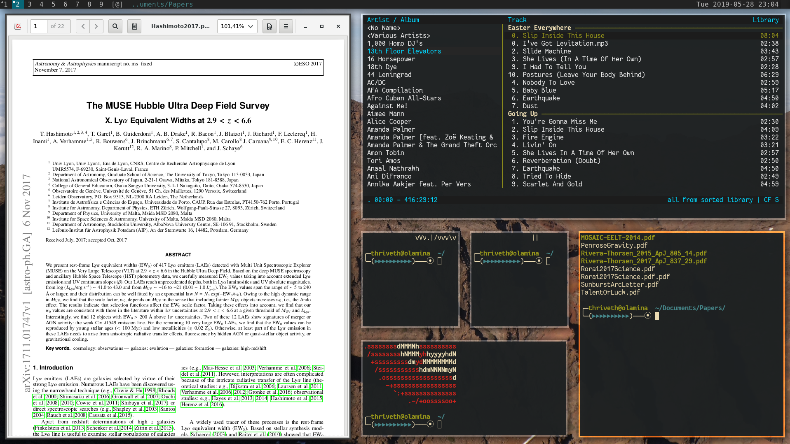

# My build of dwm

This is a set of patches and a build script for `dwm` window manager from
suckless.org. It worked for me at the time of writeing, is all I can say. 

## How to install:

- Get dwm via git from the suckless website. 
- Copy the files in this repository into the dwm folder you just downloaded.
- Make sure the `build.sh` script is executable, by running e.g. `chmod u+x
  build.sh` in the `dwm` folder.
- Run `./build.sh`.

You may want to remove some of the patches, in that case, the `my_tweaks.diff`
patch may also break, and you must apply whatever tweaks you want in
`config.def.h` manually, then copy it to 1`config.h` and run `make clean
install`, possibly preceded by `sudo`.

If anything goes wrong, I probably don't know why.

## Applied patches 

### Layouts 

- Fibonacci 
- Grid
- Centeredmaster

### Other patches

- Push 
- Systray
- Pertag
- Titlecolor
- Uselessgap

Plus some of my own color and gap width and similar tweaks in the
`my_tweaks.diff` patch. 

## Caveats

`systray` compiles but I still cannot figure out how to get it to work
properly. If you cannot either, I can't help you.

## Screenshot(s)

Because everyone likes pictures...

